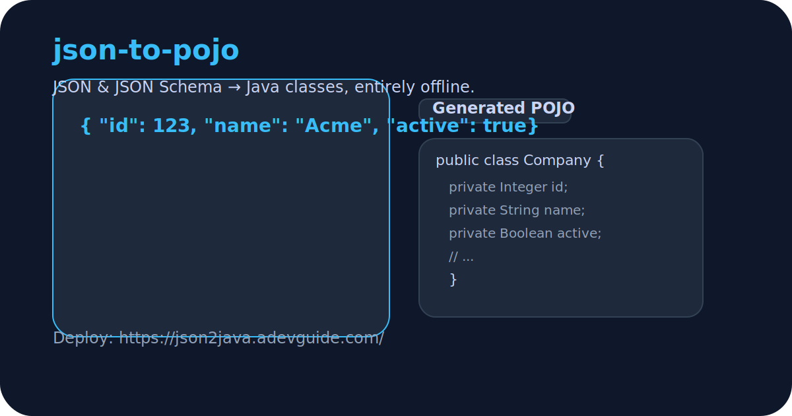

# json-to-pojo

[](https://github.com/your-org/json-to-pojo/actions/workflows/ci.yml)
[](https://github.com/your-org/json-to-pojo/actions/workflows/codeql.yml)
[](https://github.com/your-org/json-to-pojo/actions/workflows/deploy.yml)
[](#-testing)
[](#-architecture-overview)
[](https://json2java.adevguide.com/)
[](LICENSE)
[](CONTRIBUTING.md)

**JSON Schema/Example → Java POJOs, no backend required.** Generate clean Java models in your browser with Monaco-powered editing, shadcn UI, and a Web Worker pipeline. Deployed live at [json2java.adevguide.com](https://json2java.adevguide.com/).

---



## ✨ Highlights
- **Zero server** – everything runs locally in the browser.
- **Dual input** – infer from raw JSON or feed in full JSON Schemas.
- **Rich options** – Lombok, Jackson/Gson/Moshi annotations, collection & numeric strategies, null handling, nested classes, enums, and more.
- **Responsive** – generation works in a dedicated Web Worker with timeout and payload size guardrails.
- **Instant previews** – Monaco-based Java viewer, file tree, and ZIP download of all generated classes.
- **Accessible UI** – Tailwind + shadcn components, keyboard navigation, dark/light theme toggle.

## 🌐 Quick Links
- **Live app**: https://json2java.adevguide.com/
- **Report a bug / Security contact**: [hello@pratik-bhuite.com](mailto:hello@pratik-bhuite.com)
- **Contributing guide**: [CONTRIBUTING.md](CONTRIBUTING.md)
- **Security policy**: [SECURITY.md](SECURITY.md)

## 🚀 Getting Started

```bash
npm install
npm run dev
```

Visit `http://localhost:5173` to use the app.

### Available Scripts

| Command | Description |
| --- | --- |
| `npm run dev` | Start Vite dev server |
| `npm run build` | Type-check and build production bundle |
| `npm run preview` | Preview the built app |
| `npm run lint` | Lint TS/TSX files |
| `npm run typecheck` | Run TypeScript without emit |
| `npm run test` | Vitest + RTL with coverage |
| `npm run audit` | npm security audit |
| `npm run deploy` | Build + publish to GitHub Pages |

## 🧠 Architecture Overview

```
src/
├── App.tsx              # Main layout + orchestration
├── components/          # UI primitives & feature widgets (Monaco editor, outputs)
├── core/                # Generator pipeline: inference, naming, emission
├── hooks/useGeneratorWorker.ts # Worker bridge with timeout management
├── lib/                 # Utilities (Trusted Types, schema validation, downloads)
├── state/               # Zustand stores for theme + generator options
└── workers/             # Web Worker entry (generation off the main thread)
```

Key libraries:
- **React + TypeScript + Vite**
- **Tailwind CSS**, **shadcn/ui**, **lucide-react**
- **Monaco Editor**, **AJV**, **Zod**, **JSZip**
- **Zustand** for state, **Vitest + RTL** for testing

## 🔒 Security & Privacy
- Trusted Types policy initialization (`src/lib/trustedTypes.ts`).
- JSON input capped at 2 MB; heavy work stays in Web Worker.
- Blob download URLs are revoked immediately after use.
- No analytics, telemetry, or network calls required.
- See [SECURITY.md](SECURITY.md) for disclosure guidance.

## 📦 Continuous Delivery
- **CI**: lint → typecheck → tests → build → audit (GitHub Actions).
- **CodeQL**: weekly static analysis scan.
- **Deploy**: GitHub Pages workflow builds from `main`.
- **Dependabot**: weekly dependency updates for npm modules and GitHub Actions.

## ☁️ Deploying Elsewhere

### GitHub Pages
Set `GITHUB_PAGES=true` for the build, then either run `npm run deploy` locally or rely on `.github/workflows/deploy.yml`. The app is a static bundle in `dist/`.

### Cloudflare Pages
1. Push this repo to GitHub.
2. In Cloudflare Pages: **Create project → Connect to Git → select repo**.
3. Build command: `npm run build` · Output directory: `dist`.
4. Deploy. Optional: add custom domain and enable previews.

## 🤝 Contributing
We enthusiastically welcome contributions! Please read:
- [CONTRIBUTING.md](CONTRIBUTING.md)
- [CODE_OF_CONDUCT.md](CODE_OF_CONDUCT.md)

Submit issues or PRs to improve the generator, UI polish, or docs.

## 📫 Contact
Questions, bugs, or security reports? Email **hello@pratik-bhuite.com**.

## 📄 License
Released under the [MIT License](LICENSE).
